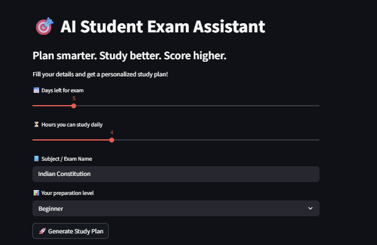
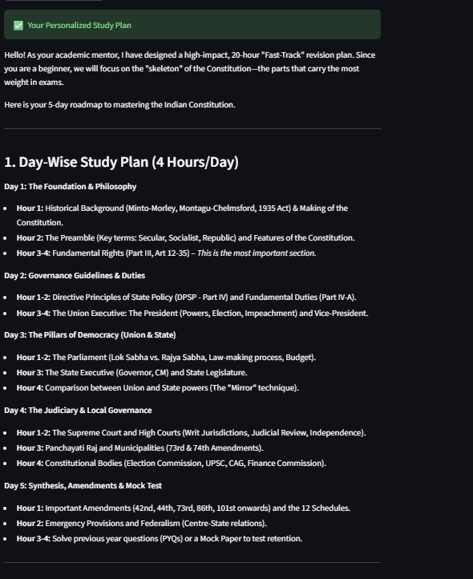
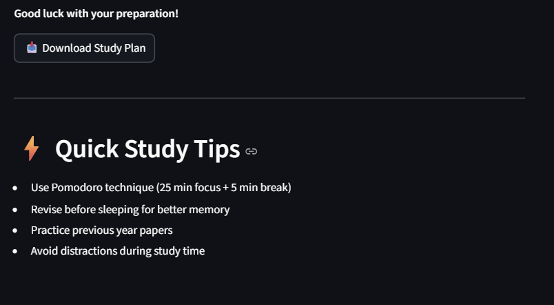

# 🎯 AI Student Exam Assistant

> Plan smarter. Study better. Score higher.

An AI-powered academic strategy engine that generates **personalized, time-optimized study plans** using Google Gemini.

---

## 🚀 Overview

AI Student Exam Assistant helps students convert **limited time into maximum results** by generating structured, day-wise study plans based on:

- 📅 Days left for exam  
- ⏳ Daily study hours  
- 📘 Subject  
- 📊 Preparation level  

Built with **Streamlit + Google Gemini AI**, this app acts like a **personal academic mentor**.

---

## 💡 Problem Statement

Students often struggle with:

- ❌ What to study first  
- ❌ How to plan limited time  
- ❌ Inefficient revision strategies  
- ❌ Exam anxiety due to lack of structure  

---

## ✅ Solution

This project provides:

- 📅 Day-wise structured study plans  
- 🎯 Priority-based topic suggestions  
- ⚡ Adaptive strategies (Crash / Revision / Balanced)  
- 🧠 AI-driven personalized recommendations  

---

## 🧠 Key Features

- 🎯 Personalized Study Plans  
- ⚡ Smart Strategy Engine (based on time & level)  
- 📊 Interactive UI with sliders & inputs  
- 📥 Downloadable study plans  
- 🧠 AI-powered structured responses  
- ⚠️ Urgency detection (last-minute exam warnings)  

---

## 🧩 System Architecture
User Input → Strategy Engine → Prompt Generator → Gemini API → Response Formatter → UI Output

---

## ♿ Accessibility

This application is designed with user accessibility in mind:

- Clear labels and instructions for all inputs
- Help tooltips for better understanding
- Simple and clean UI using Streamlit
- Error messages designed for non-technical users
- Visual indicators like progress bars for guidance

The app ensures usability for beginners and non-technical users.

---

## ⚙️ How It Works

1. User enters:
   - Exam days
   - Study hours
   - Subject
   - Preparation level  

2. System:
   - Determines strategy (Crash / Revision / Balanced)
   - Generates optimized prompt  

3. Gemini AI:
   - Produces structured study plan  

4. Output:
   - Displayed in UI  
   - Available for download  

---

## ☁️ Google Services Used

- Google Gemini API (Generative AI)
- Secure API key handling via environment variables

---

## 🧪 Testing

This project includes unit testing using pytest.

Test coverage includes:
- Strategy logic validation
- Edge case handling
- Mode-based behavior (Normal vs Last-Minute)

To run tests:

```bash
pytest
```

---

## ⚡ Efficiency

The application is optimized for performance:

- Uses caching to avoid redundant API calls
- Minimizes response latency
- Optimized prompt design to reduce token usage
- Lightweight Streamlit interface for fast loading
- Tracks response generation time

This ensures faster and resource-efficient execution.

---

## 🚀 Unique Value Proposition

Unlike generic AI tools, this project:

- Focuses on **time-based planning**
- Adapts strategy dynamically  
- Provides **actionable daily plans**, not just suggestions  
- Lightweight, fast, and practical  

---

## 📊 Impact

- ⏱ Saves 2–3 hours of planning time  
- 📈 Improves study efficiency  
- 🧠 Reduces exam stress  
- 🎯 Helps students focus on high-impact topics  

---

## 🛠️ Tech Stack

- Python  
- Streamlit  
- Google Gemini API  
- Prompt Engineering  

---

## 📸 Demo

  
  


---

## 🔗 Live App

👉 https://ai-student-exam-assistant.streamlit.app/

---

## ⚙️ Installation

```bash
git clone https://github.com/maruthisaiteja/ai-student-exam-assistant
cd ai-student-exam-assistant
pip install -r requirements.txt
streamlit run app.py
```
---

### 🔐 Environment Setup
Create .env or Streamlit Secrets:

    GEMINI_API_KEY=your_api_key

---

## 📈 Future Enhancements
📅 Google Calendar integration
📊 Progress tracking dashboard
📚 Subject-wise syllabus breakdown
🧠 Weak topic analysis
🔔 Smart reminders

---

## 👨‍💻 Author

Maruthi Sai Teja
B.Tech | AI Enthusiast | Builder 🚀